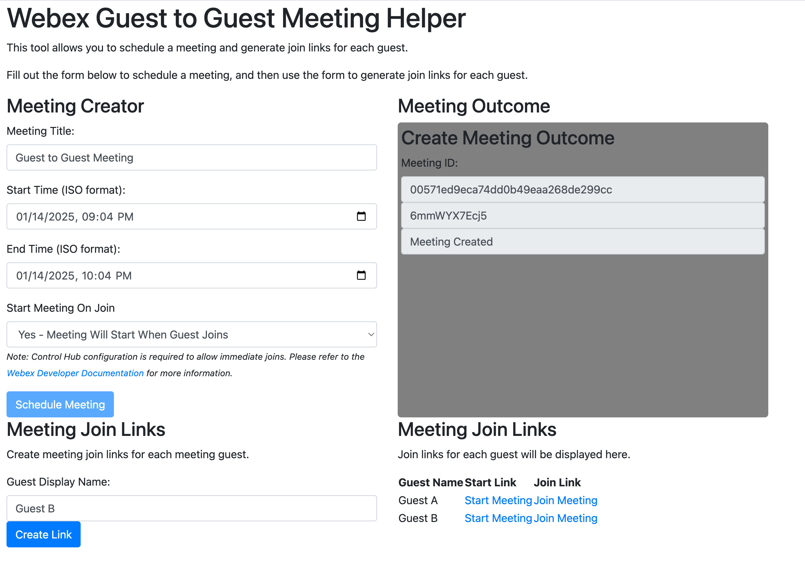

# Guest to Guest Meeting Facilitator

The Guest to Guest Meeting Facilitator is a service app that allows users to create and manage Webex meetings on behalf of other users. This project is a reference implementation of the [Service Apps as G2G Meeting Facilitator Guide](https://developer.webex.com/docs/service-apps-as-g2g-meeting-facilitator-guide).



## Getting Started

To get started with this project, you'll need to obtain a service app access token. Follow the steps below to generate the token:

1. Go to the [Webex Developer Portal](https://developer.webex.com/) and sign in.
2. Navigate to the [Service Apps as G2G Meeting Facilitator Guide](https://developer.webex.com/docs/service-apps-as-g2g-meeting-facilitator-guide) documentation.
3. Follow the instructions in the guide to generate a service app access token with the mandatory scopes `guest-meeting:rw`, `meeting:schedules_read`, `meeting:schedules_write`, and any additional desired scopes.

## Installation

1. Clone the repository:

```bash
git clone
```

2. Install the dependencies:

```bash
pip install -r requirements.txt
```

## Usage

1. Set the environment variable `WEBEX_ACCESS_TOKEN` to the service app access token generated in the [Getting Started](#getting-started) section.
2. Run the app:

```bash
flask run
```

3. Open a browser and navigate to `http://localhost:5000/` to access the app.
4. Create a new meeting by entering the meeting details and clicking the `Create Meeting` button.
5. Create meeting join links for the meeting by entering a guest display name and clicking the `Create Join Link` button.
6. Copy the join links and share it with each of the guests.
